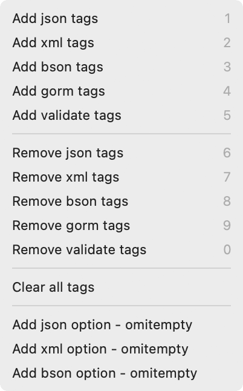

# Go Modify Tags for TextMate2

This is the TextMate2 implementation of Fatih’s [gomodifytags][01].


---

## Requirements

You need to install;

```bash
go install github.com/fatih/gomodifytags@latest
```

Then check your TextMate2 settings / variables option. If your `GOPATH` not
set, find your `GOPATH` and add there;

```bash
go env GOPATH  # grab the value; e.g: /Users/vigo/.local/go
```

Your path variable should look like this:

    [x] PATH <GRABBED-VALUE>:<REST-OF-THE-VALUES>
             # e.g:
             /Users/vigo/.local/go/bin:/opt/homebrew/bin:/opt/homebrew/opt/go/bin:${PATH} 

---

## Install and Update

```bash
cd ~/Library/Application\ Support/TextMate/Bundles/
git clone https://github.com/vigo/textmate2-gomodifytags.git GoModifyTags.tmbundle

# update
cd ~/Library/Application\ Support/TextMate/Bundles/GoModifyTags.tmbundle
git pull origin main
```

---

## Editor Features

All of the commands work with <kbd>⌥</kbd> + <kbd>⌘</kbd> + <kbd>T</kbd>
(option+cmd+T) while you are in go scope:



This operation doesn’t save the current file on purpose! You need to save your
current file after change!

---

## Contribute

PR’s are very welcome!

1. `fork` (https://github.com/vigo/textmate2-gomodifytags/fork)
2. Create your `branch` (`git checkout -b my-feature`)
3. `commit` yours (`git commit -am 'added feature'`)
4. `push` your `branch` (`git push origin my-feature`)
5. Than create a new **Pull Request**!

---

## Contributor(s)

- [Uğur "vigo" Özyılmazel][vigo] - Creator, maintainer

---

## License

This project is licensed under MIT.

---

[01]:   https://github.com/fatih/gomodifytags
[vigo]: https://vigo.io
